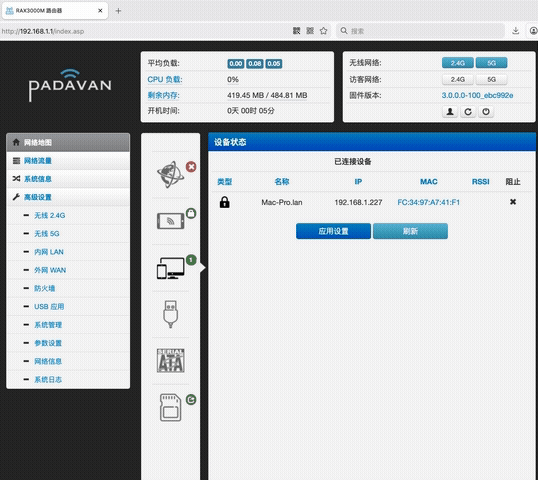

# Padavan ARM Porting (Kernel 5.15)

This is an **ARM-based** port of the Padavan firmware, specifically optimized for modern hardware and newer kernel features.

## Project Overview
- **Upstream Source**: Originally derived and ported from [hanwckf/padavan-4.4](https://github.com).
- **Kernel Version**: `5.15.167`
  - Forked from **OpenWrt 23.05.5** stable kernel.
  - Integrated with **MT7981** specific patches and drivers.
- **Architecture**: ARM (AArch64).

## Supported Platforms
The project currently supports development and deployment on:
- [x] **QEMU** (Emulation for development)
- [x] **RAX3000M(emmc)** (Physical hardware based on MediaTek MT7981 with emmc)
- [x] **RAX3000M(nand)** (Physical hardware based on MediaTek MT7981 with nand) ongoing

## Development Progress (Current Status)
The project is under active development. Key milestones achieved:
- [x] **Kernel 5.15.167** bootable on ARM/AArch64.
- [x] **LAN Side Services**:
  - `dnsmasq` / **DHCP** / **Samba** / **vsftpd** servers are fully functional.
  - `httpd` web server is up and running.
  - **WebUI (WWW)** is accessible and stable.
- [x] **WAN Side**: (udhcpc works for Dyamic IPoE and PPPoE)
- [x] **Wlan**: (MT7981,MT7915E, kernel driver is ready).
- [x] **Wi-Fi Tools**: 
  - Modern Tools `iw`, `hostapd`, `libnl-tiny`, `wireless-regdb` porting done.
- [x] **Wi-Fi**: (In Progress).
  - [x] `2.4Ghz` works.
  - [x] `5Ghz` works, All bandwidth works `20Mhz` `40Mhz` `80Mhz` `160Mhz`
  - [x] User/Psw  Settings is works.
  - [ ] `Other Settings from WebUI is ongoing.`
- [x] **Features**: CAKE/QoS with TC.
- [x] *NVRAM*: Works.
- [x] *USB*: Works.
- [x] *LED*: Works.
- [x] **Web Upgrade**: Works.
  - Supported the sysupgrade style tar to update kerel and rootfs partitions.
- [!] **Note**: Most unenabled features are currently under discovery and fixing.

### Demo for WebUI




### Deme for iperf3

Lan PC with Android Mobile through 5Ghz Wifi
```bash
Mac-Pro:~ lanbing$ iperf3 -s -p 7799
-----------------------------------------------------------
Server listening on 7799 (test #1)
-----------------------------------------------------------
Accepted connection from 192.168.1.1, port 45698
[  5] local 192.168.1.2 port 7799 connected to 192.168.1.1 port 45700
[ ID] Interval           Transfer     Bitrate
[  5]   0.00-1.00   sec  74.4 MBytes   624 Mbits/sec                  
[  5]   1.00-2.00   sec  80.0 MBytes   671 Mbits/sec                  
[  5]   2.00-3.00   sec  85.0 MBytes   714 Mbits/sec                  
[  5]   3.00-4.00   sec  81.1 MBytes   681 Mbits/sec                  
[  5]   4.00-5.00   sec  88.4 MBytes   741 Mbits/sec                  
[  5]   5.00-6.00   sec  91.1 MBytes   762 Mbits/sec                  
[  5]   6.00-7.00   sec   101 MBytes   852 Mbits/sec                  
[  5]   7.00-8.00   sec   103 MBytes   865 Mbits/sec                  
[  5]   8.00-9.00   sec  98.6 MBytes   827 Mbits/sec                  
[  5]   9.00-10.00  sec   102 MBytes   852 Mbits/sec                  
[  5]  10.00-10.03  sec  3.38 MBytes   833 Mbits/sec                  
- - - - - - - - - - - - - - - - - - - - - - - - -
[ ID] Interval           Transfer     Bitrate
[  5]   0.00-10.03  sec   908 MBytes   759 Mbits/sec                  receiver

```


## Getting Started
### Prerequisites

* Based on ubuntu-20.04, and install below packages.
* Suggest use Docker with ubuntu-20.04 base.

```bash
ln -snf /usr/share/zoneinfo/$CONTAINER_TIMEZONE /etc/localtime && echo $CONTAINER_TIMEZONE > /etc/timezone

apt-get update && apt-get install -y texinfo libtool-bin gperf python3-docutils autopoint gettext
apt-get install -y sudo time git-core subversion build-essential g++ bash make \
        libssl-dev patch libncurses5 libncurses5-dev zlib1g-dev gawk \
        flex gettext wget unzip xz-utils python python-distutils-extra \
        python3 python3-distutils-extra python3-setuptools swig rsync curl \
        libsnmp-dev liblzma-dev libpam0g-dev cpio rsync gcc-multilib bc vim \
        cmake  bison libnfnetlink-dev libnfnetlink0 kmod libelf-dev help2man \
        libthread-queue-any-perl python3-dev xsltproc \
        libboost-dev  libxml-parser-perl   libusb-dev  \
        groff automake-1.15

```

### Build Instructions

To build the firmware for a specific target, use the following commands:

``` bash

cd trunk
fakeroot ./build_firmware_modify QEMU
fakeroot ./build_firmware_modify RAX3000M

```


__Default Access__
- **Default IP**: `192.168.1.1` (or your configured LAN IP)
- **User/Psw**: `admin` / `admin`
- **Wifi Name**: `RAX3000M_FFFF`/`RAX3000M_FFFF_5G` (DFS with 60sec CAC)
- **Wifi Psw**: 1234567890

__Run on QEMU__

``` bash
qemu-system-aarch64 -m 512 -cpu cortex-a53 -M virt-2.9  -kernel ~/workdir/Image.gz  -D qemu_a53.log -nographic -initrd ~/workdir/ramdisk -append "root=/dev/ram0" -device virtio-net-pci,netdev=net0 -netdev user,id=net0,hostfwd=tcp:127.0.0.1:8800-10.0.2.15:80

Enable eth0:

ip link set eth0 up
ip addr add 10.0.2.15/24 dev eth0
ip route add default via 10.0.2.2 dev eth0

# check the virt gateway
ping 10.0.2.2

```


__Run on RAX3000M__

1. Flash the fip with mtk_uartboot

fip and bl2 and other binaries are picked from :

https://www.right.com.cn/forum/thread-8400306-1-1.html

https://downloads.immortalwrt.org/releases/23.05.0/targets/mediatek/filogic/

You can find the binaries from RAX3000M_flash_bins folder.

```
./mtk_uartboot -s /dev/<uart_port> --brom-load-baudrate 115200 --bl2-load-baudrate 115200 -p mt7981-ram-ddr4-bl2.bin -a -f mt7981-cmcc_rax3000m-emmc-fip.bin

```


2. Flash the "sysupgrade_cmcc_rax3000m-emmc-ubootmod.bin" to the emmc board through uboot.


__Partion layout with this rax3000m build__

https://www.right.com.cn/forum/thread-8400306-1-1.html

```
MT7981> mmc part

Partition Map for MMC device 0  --   Partition Type: EFI

Part	Start LBA	End LBA		Name
	Attributes
	Type GUID
	Partition GUID
  1	0x00002000	0x000023ff	"u-boot-env"
	attrs:	0x0000000000000000
	type:	0fc63daf-8483-4772-8e79-3d69d8477de4
		(linux)
	guid:	493dcd1a-59c0-11ee-b4d0-b083fea0360d
  2	0x00002400	0x000033ff	"factory"
	attrs:	0x0000000000000000
	type:	0fc63daf-8483-4772-8e79-3d69d8477de4
		(linux)
	guid:	493ddcce-59c0-11ee-b4d0-b083fea0360d
  3	0x00003400	0x000053ff	"fip"
	attrs:	0x0000000000000000
	type:	0fc63daf-8483-4772-8e79-3d69d8477de4
		(linux)
	guid:	493de9f8-59c0-11ee-b4d0-b083fea0360d
  4	0x00016000	0x0001ffff	"config"
	attrs:	0x0000000000000000
	type:	0fc63daf-8483-4772-8e79-3d69d8477de4
		(linux)
	guid:	493df68c-59c0-11ee-b4d0-b083fea0360d
  5	0x00020000	0x0003ffff	"kernel"
	attrs:	0x0000000000000000
	type:	0fc63daf-8483-4772-8e79-3d69d8477de4
		(linux)
	guid:	493e030c-59c0-11ee-b4d0-b083fea0360d
  6	0x00040000	0x0016bfff	"rootfs"
	attrs:	0x0000000000000000
	type:	0fc63daf-8483-4772-8e79-3d69d8477de4
		(linux)
	guid:	493e0f82-59c0-11ee-b4d0-b083fea0360d
```

__Disabled Path__

- mips-toolchain
- trunk/libc/uclib
- trunk/linux-4.4.198

__Inctroduced Path__

- aarch64-gcc-musl
- trunk/linux-5.15.167


*Disclaimer: This is an experimental porting version by Lan Bing. Use at your own risk.*


---


# padavan-4.4 #

This project is based on original rt-n56u with latest mtk 4.4.198 kernel, which is fetch from D-LINK GPL code.

- Features
  - Based on 4.4.198 Linux kernel
  - Support MT7621 based devices
  - Support MT7615D/MT7615N/MT7915D wireless chips
  - Support raeth and mt7621 hwnat with legency driver
  - Support qca shortcut-fe
  - Support IPv6 NAT based on netfilter
  - Support WireGuard integrated in kernel
  - Support fullcone NAT (by Chion82)
  - Support LED&GPIO control via sysfs

- WIP
  - 802.11kvr and mtkiappd roam functions
  - IPTV related functions

- Supported devices
  - CR660x
  - JCG-Q20
  - JCG-AC860M
  - JCG-836PRO
  - JCG-Y2
  - DIR-878
  - DIR-882
  - K2P
  - K2P-USB
  - NETGEAR-BZV
  - MR2600
  - MI-R3P
  - XY-C1

- Compilation step
  - Install dependencies
    ```sh
    # Debian/Ubuntu
    sudo apt install unzip libtool-bin curl cmake gperf gawk flex bison nano xxd \
        fakeroot kmod cpio git python3-docutils gettext automake autopoint \
        texinfo build-essential help2man pkg-config zlib1g-dev libgmp3-dev \
        libmpc-dev libmpfr-dev libncurses5-dev libltdl-dev wget libc-dev-bin

    # Archlinux/Manjaro
    sudo pacman -Syu --needed git base-devel cmake gperf ncurses libmpc \
            gmp python-docutils vim rpcsvc-proto fakeroot cpio help2man

    # Alpine
    sudo apk add make gcc g++ cpio curl wget nano xxd kmod \
        pkgconfig rpcgen fakeroot ncurses bash patch \
        bsd-compat-headers python2 python3 zlib-dev \
        automake gettext gettext-dev autoconf bison \
        flex coreutils cmake git libtool gawk sudo
    ```
  - Clone source code
    ```sh
    git clone https://github.com/hanwckf/padavan-4.4.git
    ```
  - Prepare toolchain
    ```sh
    cd padavan-4.4/toolchain-mipsel

    # (Recommend) Download prebuilt toolchain for x86_64 or aarch64 host
    ./dl_toolchain.sh

    # or build toolchain with crosstool-ng
    # ./build_toolchain
    ```
  - Modify template file and start compiling
    ```sh
    cd padavan-4.4/trunk

    # (Optional) Modify template file
    # nano configs/templates/K2P.config

    # Start compiling
    fakeroot ./build_firmware_modify K2P

    # To build firmware for other devices, clean the tree after previous build
    ./clear_tree
    ```

- Manuals
  - Controlling GPIO and LEDs via sysfs
  - How to use NAND RWFS partition
  - How to use IPv6 NAT and fullcone NAT
  - How to add new device support with device tree
